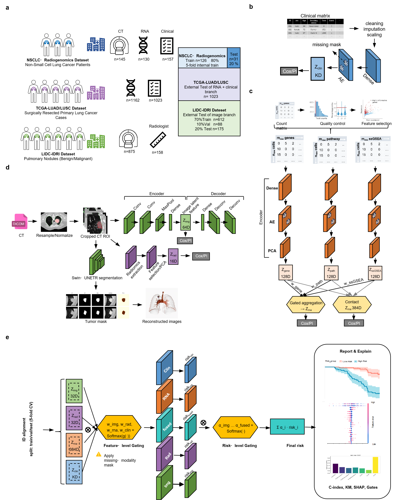
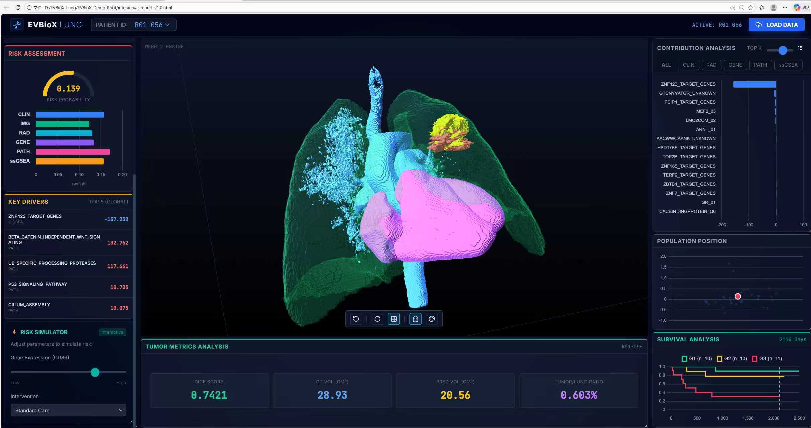
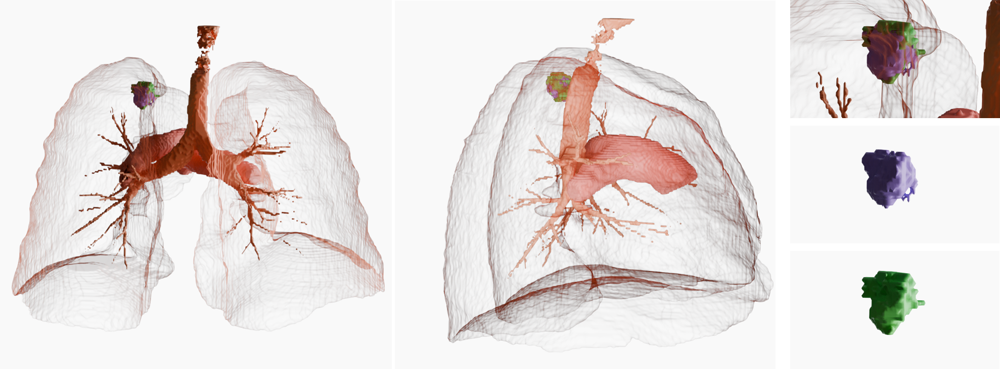
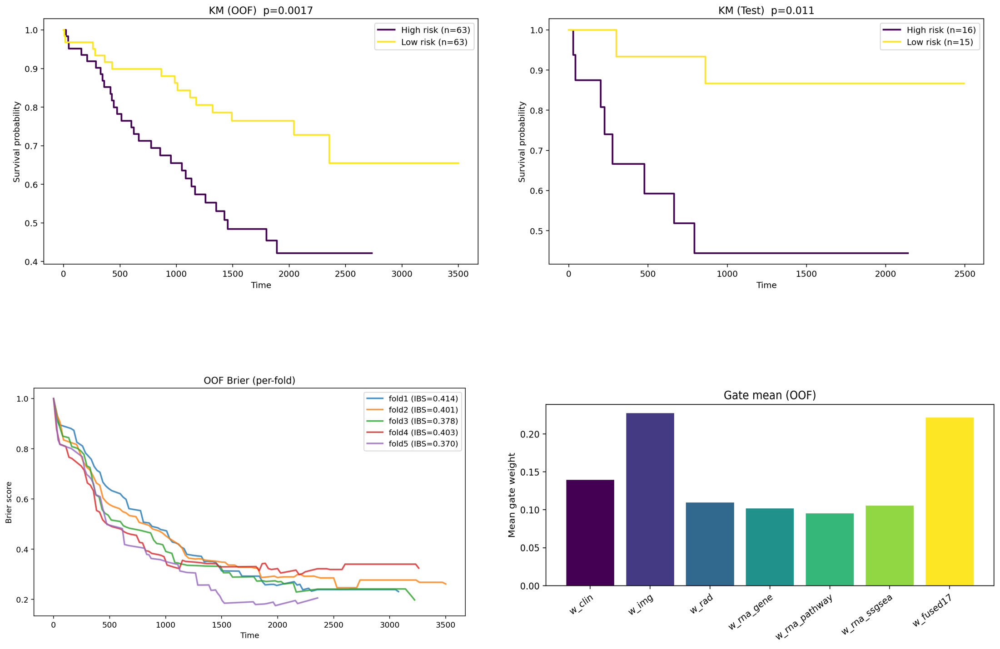

# EVBioX-Lung

> A showcase-ready NSCLC pipeline for CT tumor segmentation and multimodal risk fusion.

EVBioX-Lung is a curated public showcase of an end-to-end workflow for **NSCLC CT tumor segmentation** and **multimodal risk fusion analysis**.  
This repository focuses on a **readable, privacy-first, demo-oriented release** rather than a full internal research dump.

---

## Highlights

- End-to-end workflow: **extraction → preprocessing → audit → datalist → segmentation → fusion report**
- Public-showcase structure with lightweight docs and curated demo assets
- Demo-ready materials including **interactive HTML**, **3D STL examples**, and **risk-related CSV outputs**
- Privacy-first release boundary: **no raw medical data**, **no heavy historical outputs**, **no machine-specific absolute paths**
- Suitable as a portfolio/research showcase for biomedical AI and medical imaging pipeline design

---

## Demo Preview

### Workflow Overview


### Interactive Report


### 3D Tumor Visualization


### Risk / Survival Showcase


---

## Repository Structure

```text
evbiox-lung/
├─ README.md
├─ LICENSE
├─ environment.yml
├─ docs/
│  ├─ PROJECT_OVERVIEW.md
│  ├─ METHOD_PIPELINE.md
│  ├─ DEMO_ASSETS.md
│  ├─ SHOWCASE_STRUCTURE_PLAN.md
│  └─ GITHUB_RELEASE_CHECKLIST_MINI.md
├─ nsclc_swinunetr/
│  ├─ scripts/
│  │  ├─ 01_extract_series.py
│  │  ├─ 02_preprocess_nsclc_vessel.py
│  │  ├─ 04_audit.py
│  │  ├─ 05_make_datalist_nsclc.py
│  │  ├─ 06_train_seg_nsclc.py
│  │  └─ 17_fusion_report_allin1_strict.py
│  └─ configs/
│     ├─ extract_nsclc.example.yaml
│     ├─ preprocess_nsclc_vessel.example.yaml
│     ├─ audit_roi.example.yaml
│     ├─ datalist_nsclc.example.yaml
│     ├─ train_seg_nsclc.example.yaml
│     └─ fusion_report_nsclc.example.yaml
├─ datalist/
├─ data/
│  └─ README.md
├─ scripts/
│  └─ run_demo_placeholder.md
└─ demo/
   ├─ interactive/
   │  └─ interactive_report_v1.0.html
   └─ assets/
      ├─ csv/
      │  ├─ R01-056_tumor_metrics.csv
      │  ├─ risk_groups.csv
      │  └─ km_curves_q3.csv
      ├─ stl/
      │  ├─ R01-056_tumor_gt.stl
      │  └─ R01-056_tumor_pred.stl
      └─ images/
         ├─ workflow-overview.png
         ├─ interactive-report-overview.png
         ├─ stl-gt-vs-pred.png
         └─ risk-km-overview.png

Example cfg-driven workflow

The example scripts below use `--cfg` with public example YAML files.